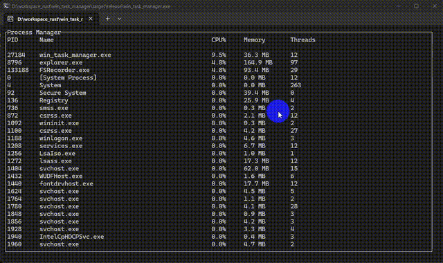

# Windows 任务管理器工具
> 本项目使用`InsCode IDE`编写，使用`rustc 1.82.0`编译

一个基于Rust开发的Windows任务管理器工具，提供系统进程和资源监控功能。

## 功能特性

- 查看系统运行中的进程列表
- 显示进程的CPU和内存使用情况
- 支持终止指定进程
- 简洁的终端用户界面

## 安装和使用

### 前置要求
- Rust工具链 (rustc 1.82.0)
- Windows操作系统

### 安装
```bash
git clone https://github.com/your-repo/win_task_manager.git
cd win_task_manager
```

### 构建和运行
```bash
cargo build --release
cargo run
```

发布版本会生成在`target/release/`目录下。

## 构建选项

可以通过修改`resources/task_manager.rc`文件来自定义程序图标。

## 演示视频

项目演示视频:



## 使用说明

程序启动后会显示系统进程列表，包含以下信息：
- PID (进程ID)
- 进程名称
- CPU使用率(%)
- 内存使用量(MB)

### 快捷键功能
- `q` 键: 退出程序
- `c` 键: 按CPU使用率排序
- `m` 键: 按内存使用量排序
- `p` 键: 按进程ID排序
- `n` 键: 按进程名称排序

## 许可证

本项目采用 [Apache-2.0 license](LICENSE)。